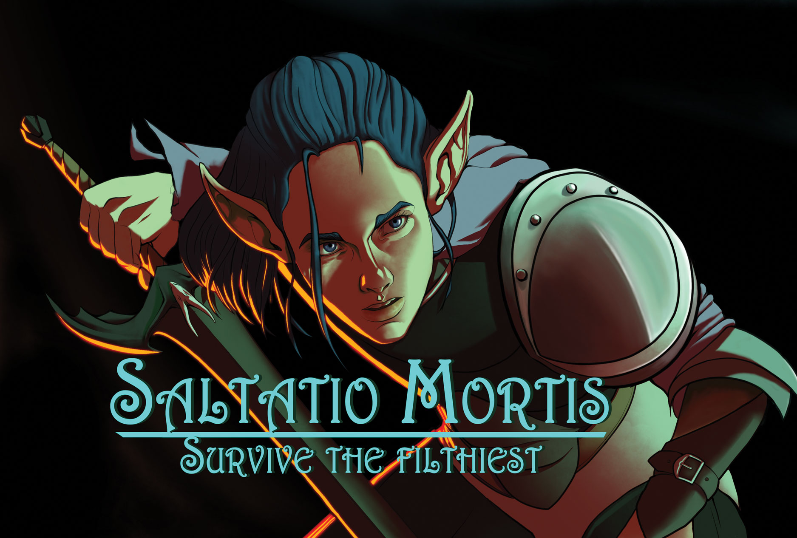

#



```HTML
<p align='center'>
    
    
</p>
```

## Table of Contents

- [Cos'è Saltatio Mortis?](#cosè-saltatio-mortis)
- [Perché lo abbiamo fatto?](#perché-lo-abbiamo-fatto)
- [Features](#features)
- [Bug noti](#bug-noti)
- [Update futuri](#update-futuri)
- [Changelog](#changelog)
- [Come contribuire](#come-contribuire)
- [Team](#team)
- [License](#license)

## Cos'è Saltatio Mortis?

**Saltatio Mortis** è un gioco di ruolo web based a turni di tipo _text-based_, dove il giocatore interagisce con personaggi non giocanti _(NPC)*, completa missioni e utilizza oggetti strategici per progredire nel gioco. Il sistema prevede una gestione avanzata di personaggi, oggetti, missioni e strategie comportamentali degli NPC.

## Perché lo abbiamo fatto?

Il progetto è nato a fini didattici come lavoro di gruppo, ma la scelta del gioco di ruolo si è rivelata ideale perché richiede di costruire un mondo simulato, con regole e comportamenti personalizzati, quasi come una trasposizione codificata della realtà.

Abbiamo trovato tutto ciò un validissimo esercizio che ci ha permesso innanzitutto di sviluppare **capacità logiche**, di **astrazione** e di **collaborazione**, di maturare un approccio alla costante risoluzione dei problemi usando il paradigma della Programmazione ad Oggetti _(OOP)*.

## Features

- Gestione dinamica di `personaggi` con attributi come salute, attacco e destrezza.
- `Oggetti` con comportamenti estendibili via classi derivate.
- `Missioni` strutturate con `ambienti`, nemici e premi.
- `Strategie` di comportamento NPC configurabili per definire stili di gioco aggressivi, difensivi o equilibrati.
- Serializzazione e deserializzazione dei dati tramite _Marshmallow* per facilità di salvataggio e caricamento.

## Bug noti

## Update futuri

- Possibilità di creare missioni
- Possibilità di gestire autonomamente i turni e gli attacchi grazie a una modalità aggiuntiva di combattimento _"Manuale"*
- Possibilità di curare i propri personaggi una volta finita la battaglia
- Aggiunta di elementi di equipaggiamento dei personaggi (armature, armi)
- Sistema di recupero dei crediti in base al punteggio ottenuto (+ bonus in caso di vittoria)
- Multiplayer mode
- Engine grafico 2D

## Changelog

Per la lista completa e dettagliata degli aggiornamenti: [CHANGELOG.md](./CHANGELOG.md)

## Come contribuire

Il tuo contributo è importante! Sentiti libero di far crescere il nostro progetto con una pull request con nuove funzionalità, correzioni di bug o miglioramenti.

Se vuoi supportare lo sviluppo e le implementazioni future, dimostraci il tuo sostegno tramite i bottoni qui sotto

[](https://github.com/delectablerec/Gdr-flask/stargazers)
[](https://github.com/delectablerec/Gdr-flask/network/members)
[](https://github.com/delectablerec/Gdr-flask/watchers)

Oppure segui [il creatore del progetto](https://github.com/delectablerec)

[](https://github.com/delectablerec)

## Team

- Ariotti Matteo
- Chiara Konrad
- Maddaloni Enrico
- Puccini Nicolò
- Fabrice Ghislain Tebou
- Trotti Enrico
- Yildiz Sidar

## License

Questo progetto è distribuito sotto licenza MIT.
Vedi il file LICENSE per i dettagli.

## Argomenti per l'orale

- ### Metodologia organizzattiva, suddivisione dei compiti e versionamento (Enrico T.)

- ### Struttura del progetto in classi, blueprint (Matteo)

- ### Standard per la documentazione, Docstring e Sphinx (Konrad)

  #### Introduzione

    Nel nostro progetto per mantenere traccia di quanto dovevevamo implementare (o che avevamo già implementato) nel codice abbiamo deciso di adottare uno standard comune per ridurre le possibilità di confusione tra i vari membri del team.
    La scelta finale è caduta un approccio professionale basato su Sphinx e docstring in stile Google, garantendo una documentazione automatica, coerente e facilmente mantenibile per tutto il codice.

  #### Sphinx: Il Motore della Documentazione

    Sphinx è molto più di un semplice generatore di documentazione: è un ecosistema completo che trasforma il codice Python in documentazione web navigabile e professionale.

    Perché Sphinx è Fondamentale
    Sphinx non si limita a leggere i commenti nel codice. Attraverso il meccanismo di _importazione dinamica*, Sphinx esegue effettivamente il nostro codice Python per estrarre informazioni dettagliate su classi, metodi, parametri e type hints. Questo significa che ogni volta che modifichiamo una funzione, la documentazione si aggiorna automaticamente senza intervento manuale.

    Come Funziona nel Nostro Progetto
    La configurazione in conf.py definisce il comportamento del sistema:

    ```python
        # Sphinx "vede" il nostro codice grazie a questo path
        sys.path.insert(0, os.path.abspath('..'))
    ```

    Questa riga è cruciale: dice a Sphinx dove trovare il nostro package saltatio_mortis, permettendogli di importare tutti i moduli.

    Le estensioni sono il cuore del sistema:
        - **autodoc**: L'estensione che fa la "magia" - scansiona il codice Python, importa i moduli e estrae automaticamente firme delle funzioni, docstring e metadati
        - **napoleon**: Traduce le nostre docstring in stile Google nel formato reStructuredText che Sphinx comprende   nativamente
        - **sphinx_autodoc_typehints**: Legge i type hints Python e li integra elegantemente nella documentazione finale

  #### Standard DocString:: Stile Google in Italiano

  Abbiamo adottato lo stile Google per la sua leggibilità e il supporto nativo in Sphinx
  (tra i vari formati disponibili (Sphinx nativo, NumPy, Google), quello di Google offre il miglior equilibrio tra leggibilità nel codice sorgente e ricchezza informativa).

  Perché in Italiano
  Abbiamo fatto la scelta consapevole di scrivere le docstring in italiano per diversi motivi:
    1. Coerenza linguistica: Il progetto è sviluppato da un team italiano per un contesto italiano
    2. Accessibilità: Facilita la comprensione per tutti i membri del team
    3. Terminologia specifica: I termini del dominio del gioco (personaggio, missione, inventario) sono più naturali in italiano

  Esempio Pratico dal Nostro Codice:

    ```python
        def usa_inventario_automatico(
        inventario: Inventario,
        pg: Personaggio,
        missione: Missione,
        bersagli: list[Personaggio],
        strategia: Strategia = None
    ) -> tuple[int | None, str]:
        """
        Utilizza un oggetto dall'inventario in modo automatico.

        Args:
            inventario (Inventario): L'inventario da cui utilizzare l'oggetto.
            pg (Personaggio): Il personaggio che utilizza l'oggetto.
            missione (Missione): La missione corrente.
            bersagli (list[Personaggio]): I bersagli dell'effetto dell'oggetto.
            strategia (Strategia, optional): Strategia da utilizzare.

        Returns:
            tuple[int | None, str]: Il risultato dell'uso dell'oggetto e messaggio descrittivo.

        Raises:
            None
        """
        """codice del metodo"""
    ```

  Ogni docstring segue sempre la stessa struttura, seppur alcuni elementi possano essere opzionali:
  - **Prima riga**: Descrizione concisa in una frase
  - **Paragrafo descrittivo**: Contesto e dettagli implementativi quando necessario
  - **Args**: Ogni parametro in ingresso con tipo e descrizione dettagliata
  - **Returns**: Cosa restituisce la funzione
  - **Raises**: Eccezioni che potrebbero essere sollevate
  - **Example**: Esempi pratici di utilizzo quando utile

  ##### Integrazione di Type Hints

  I type hints rappresentano un ponte fondamentale tra il codice moderno Python e la documentazione. Non sono semplici "decorazioni" - sono metadati ricchi che Sphinx utilizza per arricchire la documentazione.

  Come Funzionano nella Pratica
  Quando scriviamo:

    ```python
        def crea_personaggio(nome: str, classe: Type[Personaggio], livello: int = 1) -> Personaggio:
    ```

  Sphinx legge questi type hints e:
    1. **Valida la coerenza**: Controlla che la documentazione sia allineata con i tipi dichiarati
    2. **Genera collegamenti**: Crea automaticamente link tra classi correlate (Type[Personaggio] diventa un link cliccabile alla classe Personaggio)
    3. **Arricchisce la presentazione**: I tipi vengono mostrati in modo elegante nella documentazione finale

  Vantaggi Pratici
    1. Sviluppo più sicuro: Gli IDE possono fare controlli statici
    2. Refactoring sicuro: Cambiare un tipo aggiorna automaticamente tutta la documentazione
    3. Navigazione intelligente: Click su un tipo porta alla sua definizione
    4. Documentazione sempre aggiornata: Impossibile avere disallineamento tra codice e docs

  ##### Generazione Automatica

  Il processo di generazione della documentazione è il momento in cui tutto si unisce: codice, docstring, type hints e configurazione Sphinx convergono per produrre una documentazione web completa.

  Il Processo Passo-Passo
    1. _Scansione dei file_: Sphinx legge tutti i file .rst nella directory docs/
    2. _Parsing delle direttive_: Interpreta le direttive .. automodule:: per sapere quali moduli documentare
    3. _Importazione dinamica_: Esegue i vari import per ogni modulo specificato
    4. _Estrazione metadati_: Legge docstring, type hints, firme delle funzioni, gerarchie di classe
    5. _Rendering HTML_: Trasforma tutto in pagine HTML navigabili

  Dopo l'esecuzione, la directory build/html/ contiene:
  - index.html: Homepage con overview del progetto
  - Pagine per modulo: gioco.personaggio.html, auth.routes.html, etc.
  - Indici: Indice generale, indice per moduli, ricerca
  - Assets: CSS, JavaScript, font per il tema Furo
  - Sitemaps: Per l'integrazione con motori di ricerca

  Vantaggi del Processo Automatico
  1. **Zero manutenzione**: Aggiungere una nuova funzione la rende automaticamente visibile nella documentazione
  2. **Consistenza garantita**: Impossibile dimenticare di documentare qualcosa
  3. **Ricerca integrata**: JavaScript automatico per cercare attraverso tutta la documentazione
  4. **Responsive desig**n: Funziona perfettamente su mobile e desktop
  5. **Velocità**: Build completo in pochi secondi anche per progetti grandi

  La documentazione diventa così una "finestra vivente" sul nostro codice, che si aggiorna e evolve automaticamente insieme al progetto.

  #### Benefici Ottenuti

    1. Manutenibilità
        - La documentazione si aggiorna automaticamente con il codice
        - Nessuna possibilità di disallineamento tra docs e implementazione
    2. Professionalità
        - Standard industriale riconosciuto
        - Navigazione intuitiva e ricerca integrata
        - Output HTML responsive e moderno (tema Furo)
    3. Collaborazione
        - Standard condiviso tra tutti i membri del team
        - Facilita onboarding di nuovi sviluppatori
        - Code review più efficaci
    4. Coerenza
        - Formato uniforme per tutto il progetto
        - Documenti sia funzioni pubbliche che private
        - Visualizzazione chiara delle gerarchie di classe

  #### Conclusioni

    L'implementazione di Sphinx con docstring Google ha trasformato la nostra documentazione da un processo manuale e soggetto a errori in un sistema automatizzato che garantisce coerenza, completezza e professionalità, rappresentando una best practice fondamentale per qualsiasi progetto software serio.

- ### ORM SQLAlchemy, utenti, admin e privilegi (Fabrice)

- ### Funzionamento Generale del software e storia (cronologia dello sviluppo) (Nik)

- ### Transizione a Flask, dalla console alla web application (Enrico M.)

- ### Raspberry (Sidar)
