### Introduzione
Il softmare è un piccolo videogame in stile fantasy classico.
Lo sviluppo ha attraversato molte fasi, in cui, per ragioni didattiche, volta per volta, il progetto
veniva ampliato e adattato, implementando nuove funzionalità, frameworks ..ecc

```mermaid
erDiagram
    Versione_Basilare_Procedurale ||--o{ Programmazione_Funzionale : next
    Versione_Basilare_Procedurale {
        Interfaccia Terminale
        Esecuzione_semplice_e_lineare   Il_codice_viene_eseguito_linea_dopo_linea
    }
    Programmazione_Funzionale ||--o{ Programmazione_ad_oggetti : next
    Programmazione_Funzionale {
        Introdotte_le_Funzioni Ad_esempio_esegui_turno
        Vantaggio Permette_di_eseguire_multiple_volte_la_stessa_porzione_di_codice
    }
    Programmazione_ad_oggetti ||--o{ Struttura_Object_Oriented : next
    Programmazione_ad_oggetti {
        Introduzione_delle_prime_classi Torneo_Duello_Turno
        Vantaggi Maggiore_modularità_e_ordine_nella_struttura_del_codice
    }
    Struttura_Object_Oriented ||--o{ Ampliamento_Struttura_e_Nuove_Features : next
    Struttura_Object_Oriented {
        Aggiunta_di_molte_classi Rispetto_della_logica_OOP
        Esempi Personaggio_Inventario_Oggetto
        Vantaggi Scalabilità_Riutilizzo_Estendibilità
    }
    Ampliamento_Struttura_e_Nuove_Features ||--o{ Documentazione_mediante_Docstring : next
    Ampliamento_Struttura_e_Nuove_Features {
        Nuove_Classi Missione Ambiente StrategyPattern
        Classi_di_Personaggi Mago_Guerriero_e_Ladro
        Vantaggi Oggetti_che_interagiscono_fra_loro_mediante_metodi
    }
    Documentazione_mediante_Docstring ||--o{ Serializzazione_e_Deserializzazione : next
    Documentazione_mediante_Docstring {
        Finalità Descrizione_accurata_dei_metodi_e_delle_funzioni
        Utilità Utile_per_capirne_il_funzionamento
    }
    Serializzazione_e_Deserializzazione ||--o{ Interfacce_con_Flask : next
    Serializzazione_e_Deserializzazione {
        Metodi Serializzazione_su_txt Serializzazione_su_JSON
        Vantaggi Persistenza_dei_dati Salvataggio
    }
    Interfacce_con_Flask ||--o{ Uso_ORM_SQLAlchemy : next
    Interfacce_con_Flask {
        Implementazione Utilizzo_del_Framework_Flask
        Possibilità Interfacce_web_per_eseguire_il_programma
        Vantaggi Accessibilità_Usabilità
    }
    Uso_ORM_SQLAlchemy ||--o{ Suddivisione_in_Moduli_con_Blueprint : next
    Uso_ORM_SQLAlchemy {
        Implementazione Creazione_database_con_SQLAlchemy
        Esempi Memorizzazione_utenti
        Vantaggi Persistenza_dei_dati_Facilità_di_accesso
    }
    Suddivisione_in_Moduli_con_Blueprint ||--o{ Interfacce_Responsive_con_HTML_Bootstrap_e_CSS : next
    Suddivisione_in_Moduli_con_Blueprint {
        Implementazione Blueprint_per_modularizzazione
        Esempi Auth_Characters_Mission
        Vantaggi Rotte_separate_chiarezza_modularità
    }
    Interfacce_Responsive_con_HTML_Bootstrap_e_CSS ||--o{ Generazione_Documentazione_con_Sphinx : next
    Interfacce_Responsive_con_HTML_Bootstrap_e_CSS {
        Implementazione Utilizzo_di_HTML_Bootstrap_e_CSS
        Esempi Layout_adattabili_a_diversi_dispositivi
        Vantaggi Interfacce_moderne_e_gradevoli
    }
    Generazione_Documentazione_con_Sphinx {
        Implementazione Generazione_documentazione_mediante_docstrings
        Vantaggi Documentazione_consultabile_mediante_interfaccia_web
    }

    Generazione_Documentazione_con_Sphinx ||--o{ Progetto_su_Raspberry_Linux : next
    Generazione_Documentazione_con_Sphinx {
    Implementazione Generazione_documentazione_mediante_docstrings
    Vantaggi Documentazione_consultabile_mediante_interfaccia_web
    }

    Progetto_su_Raspberry_Linux {
        Implementazione Installazione_progetto_su_Raspberry_4_Pi_con_Linux
        Possibilità Consultabile_da_qualsiasi_dispositivo_mediante_browser_e_wifi
        Vantaggi Accessibilità_ovunque_facilità_di_utilizzo
    }


```
